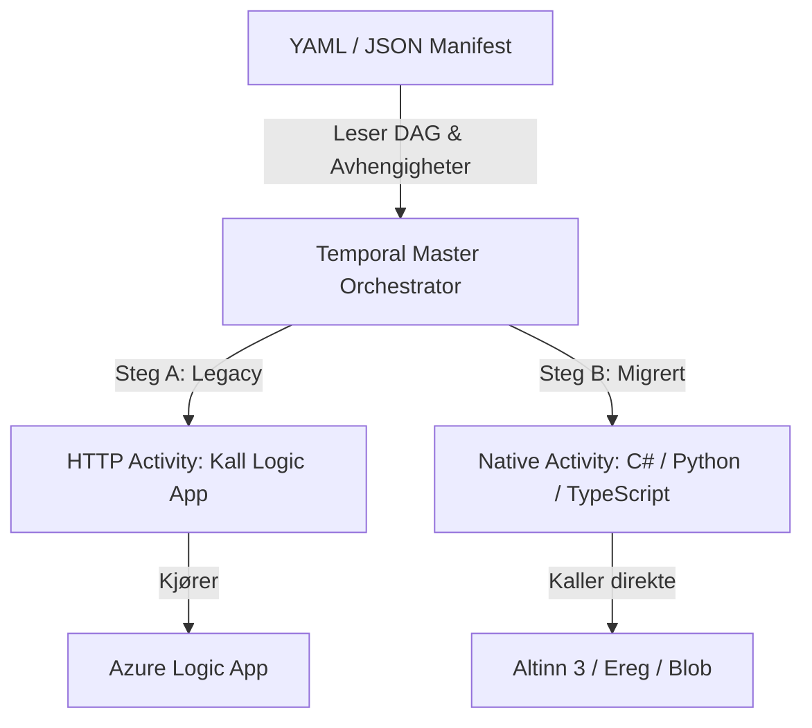

# GitHub Copilot & AI Agent Instructions

Welcome! This repository (`temporal-wonder`) tests **Temporal** as an orchestration engine for Finanstilsynet's integration platform.

Please consult the primary guideline documents before generating or modifying code:
- **Project Guidelines**: [AGENTS.md](file:///./AGENTS.md)
- **Common Guidelines**: [.agents/common-agent-instructions/](file:///./.agents/common-agent-instructions/README.md)
- **Python Guidelines**: [.agents/python-agent-instructions/](file:///./.agents/python-agent-instructions/README.md)

---

## 1. Temporal Determinism: Non-Negotiable Rules

Workflows execute replay-based state recovery. Therefore, workflows must remain **strictly deterministic**:
- **NO direct I/O**: No HTTP calls, no database access, no file system access in workflows.
- **NO direct clock/time calls**: Do NOT use `datetime.now()` or `time.time()`. Always use `workflow.now()`.
- **NO sleep calls**: Do NOT use `time.sleep()`. Always use `workflow.sleep()`.
- **NO standard random/UUID**: Do NOT use `random` or `uuid.uuid4()`. Use Temporal workflow equivalents or generate them in an activity.
- **NO threads**: Do NOT spawn background OS threads or processes.
- **ALL side effects belong in Activities**: Activities handle external HTTP requests, DB queries, and external APIs. Always set explicit timeouts and retry policies.

---

## 2. Strangler Fig Migration Pattern

Our architecture migrates legacy Azure Logic Apps incrementally:

- Manifests define DAG execution order and step dependencies (`dependsOn`).
- Legacy steps call Logic Apps via HTTP activities.
- Migrated steps call native activities directly without rewriting the whole pipeline at once.

---

## 3. Coding & QA Standards

- **Python Version**: Python 3.11+.
- **Typing**: 100% strict type hints on all functions and methods.
- **Data Models**: Use **Pydantic v2** (`BaseModel`) for all manifests, payloads, and DTOs.
- **Testing**: Test-Driven Development (TDD). Use `TestWorkflowEnvironment` for workflow tests and mocks for external dependencies.
- **Code Hygiene**: Run `ruff format .` and `ruff check --fix .` before committing. Ensure zero trailing whitespaces and a single trailing newline.
- **Issue Workflow**: Work on `gh-issue/<id>` branches and format commit messages as `(#<id>) <Description>`.
