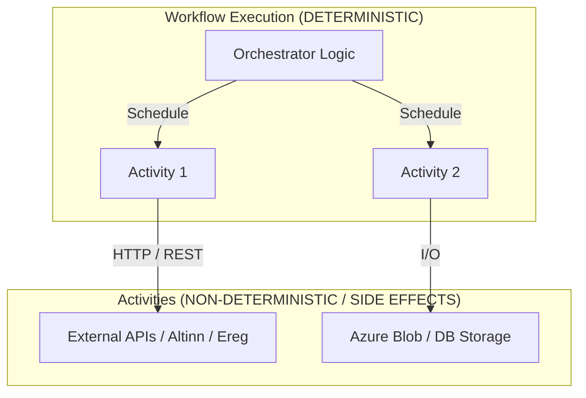
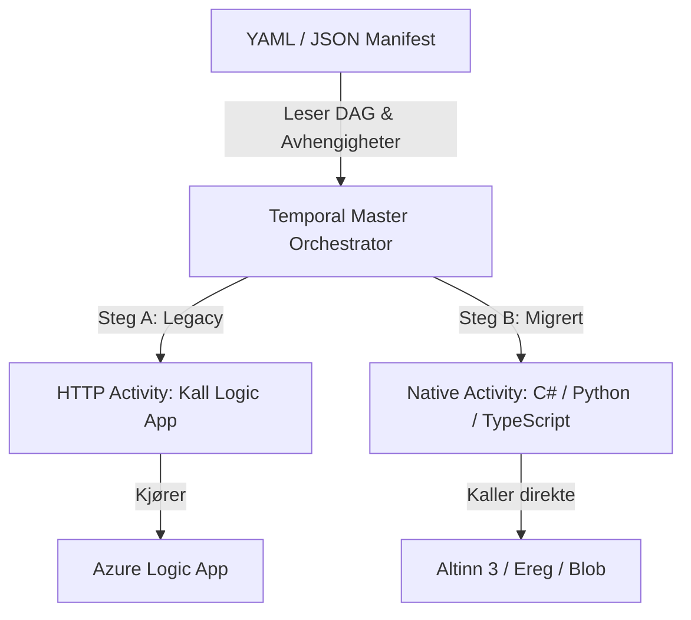

# Agent Guidelines: Temporal Wonder

This document defines the core architecture, operational constraints, and coding standards for AI agents (and human developers) contributing to `temporal-wonder`.

`temporal-wonder` is a proof-of-concept and testing repository evaluating **Temporal** as the core orchestration engine for integration pipelines at Finanstilsynet.

---

## 1. Modular Sub-guidelines & Standards

This project incorporates centralized guidelines via git submodules:

- 🔄 **Common Agent Instructions**: [`.agents/common-agent-instructions/`](file:///./.agents/common-agent-instructions/README.md)
  - [Workflow & GitHub Issue Guidelines](file:///./.agents/common-agent-instructions/WORKFLOW.md)
  - [Documentation & Mermaid Standards](file:///./.agents/common-agent-instructions/DOCUMENTATION.md)
  - [Testing & Quality Assurance](file:///./.agents/common-agent-instructions/TESTING.md)
  - [Architecture Standards](file:///./.agents/common-agent-instructions/ARCHITECTURE.md)
- 🐍 **Python Agent Instructions**: [`.agents/python-agent-instructions/`](file:///./.agents/python-agent-instructions/README.md)
  - [Python Environment & Tooling](file:///./.agents/python-agent-instructions/PYTHON_ENVIRONMENT_AND_TOOLING.md)
  - [Python Typing & Style](file:///./.agents/python-agent-instructions/PYTHON_TYPING_AND_STYLE.md)
  - [Python Testing & QA](file:///./.agents/python-agent-instructions/PYTHON_TESTING.md)
  - [Python Architecture](file:///./.agents/python-agent-instructions/PYTHON_ARCHITECTURE.md)
  - [Python Documentation](file:///./.agents/python-agent-instructions/PYTHON_DOCUMENTATION.md)

All agents working on this repository MUST abide by both the common guidelines and the Python-specific standards.

---

## 2. Temporal Core Concepts & Determinism Rules

Temporal provides durable execution through event sourcing and replay. To guarantee that workflow executions can be faithfully replayed from history, workflows **MUST BE 100% DETERMINISTIC**.

### Strict Determinism Constraints for Workflows
1. **No Direct I/O or Network Calls**: Never make HTTP requests, database queries, file reads/writes, or socket connections inside workflow code.
2. **No Non-Deterministic Functions**:
   - Do NOT use `datetime.now()` or `time.time()`. Use `workflow.now()` instead.
   - Do NOT use `time.sleep()`. Use `workflow.sleep()` instead.
   - Do NOT use standard `random.random()`, `random.randint()`, or `uuid.uuid4()`. Use Temporal's deterministic equivalents or generate random values inside an activity.
3. **No Threading or Multiprocessing**: Do not spawn native OS threads or background processes inside workflows. Use Temporal Child Workflows or async coroutines managed by the Temporal workflow event loop.
4. **No Global Mutable State**: Never rely on mutable global variables whose values can diverge between workflow runs or worker restarts.
5. **Versioning on Changes**: Any modification to existing workflow logic that alters the sequence or types of scheduled commands MUST use Temporal's workflow patch/versioning API (`workflow.patched()`).

### Activity Standards
- **Isolation of Side Effects**: All external communication, I/O, system clock access, and non-deterministic logic belong exclusively in activities.
- **Idempotency**: Activities can and will be retried automatically upon transient failure. Ensure activities are either idempotent or guarded against duplicate execution.
- **Explicit Timeouts**: Every activity call must specify explicit timeouts (e.g., `start_to_close_timeout`) and a retry policy (`RetryPolicy`).

---

## 3. Strangler Fig Migration Pattern

The primary architectural mission of this platform is to modernize and incrementally replace legacy integration pipelines (such as Azure Logic Apps) without high-risk big-bang rewrites.

### Migration Stages
1. **Stage 1 (Legacy Orchestration)**:
   - Integration workflows are described in a declarative manifest (JSON/YAML DAG).
   - The Temporal Master Orchestrator executes legacy steps by invoking `HTTP Activity: Call Logic App` with relevant payload and parameters.
2. **Stage 2 (Step-by-Step Modernization)**:
   - Specific pipeline steps are re-implemented as native activities (e.g., direct Python calls to Altinn 3, Enhetsregisteret, or Azure Blob Storage).
   - In the manifest, the step `type` transitions from `legacy_logic_app` to `native`.
3. **Stage 3 (Full Native Execution)**:
   - All legacy Logic App invocations are deprecated and phased out, leaving a clean, high-performance, fully testable native integration pipeline.

---

## 4. Code & QA Guidelines for AI Agents

1. **Strict Type Safety & Schemas**:
   - 100% type annotation coverage using modern Python syntax (PEP 585/604).
   - All manifest definitions, activity input/output DTOs, and configuration settings MUST be modeled using **Pydantic v2**.
   - Validate manifests against the formal JSON Schema (`schemas/manifest.schema.json`).
2. **Test-Driven Development (TDD)**:
   - Write tests before or alongside code implementation.
   - Use Temporal's `TestWorkflowEnvironment` for workflow tests to simulate time advancement and verify replay determinism without a live Temporal cluster.
   - Mock all external HTTP and Logic App endpoints in unit and integration test suites.
3. **Hygiene & Linting**:
   - Zero-lint policy: All code must pass `ruff format` and `ruff check`.
   - All files must end with a single trailing newline and zero trailing whitespace.
4. **Issue-Driven Workflow**:
   - All work must be conducted on dedicated issue branches (`gh-issue/<id>`), committed with prefix `(#<id>)`, and submitted via Pull Request with rebase-merge.
