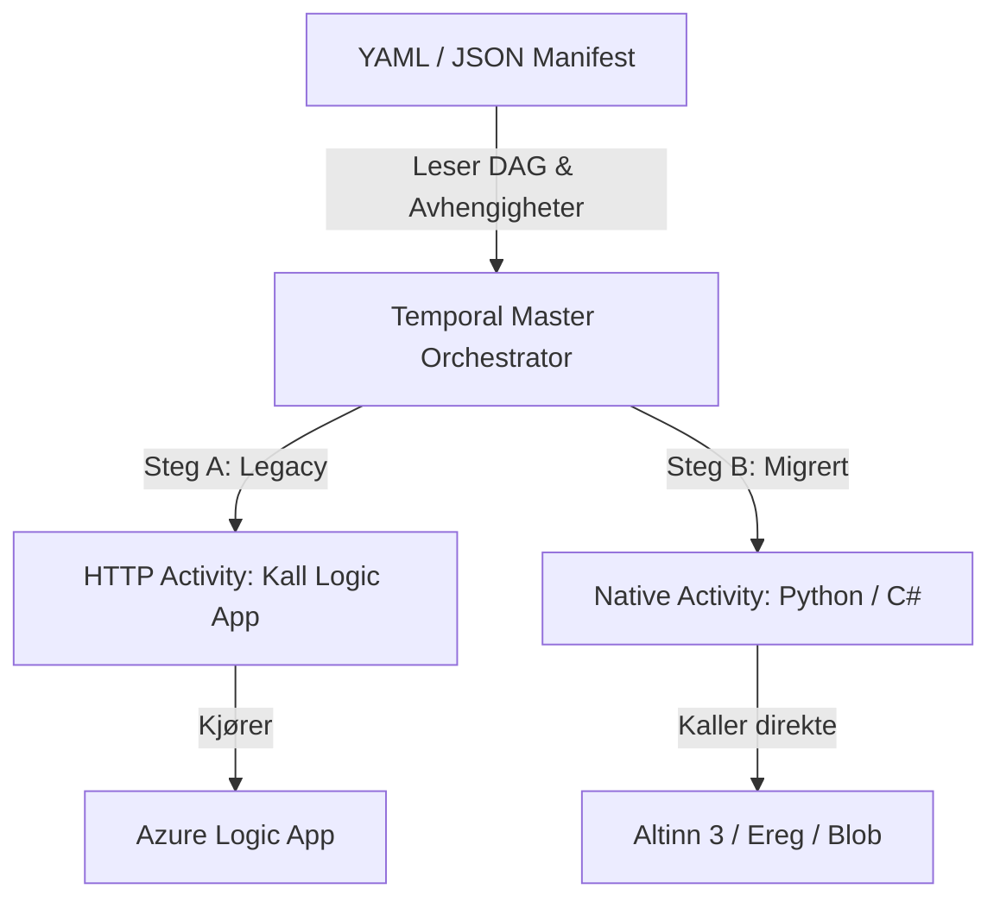

# Temporal Wonder

En test- og evalueringsplattform for å utforske **Temporal** som orkestreringsmotor for integrasjonsplattformen hos Finanstilsynet.

Repositoryet demonstrerer hvordan komplekse integrasjonsflyter kan orkestreres pålitelig, med spesiell vekt på **Strangler Fig-mønsteret** for gradvis migrering bort fra legacy Azure Logic Apps til moderne native aktiviteter.

---

## Kjernekonsepter



1. **Manifest-drevet orkestrering**: Integrasjoner defineres deklarativt som rettede asykliske grafer (DAG) i JSON/YAML.
2. **Strangler Fig-migrering**: Eksisterende Azure Logic Apps kalles via standardiserte HTTP-aktiviteter frem til de erstattes steg for steg med native kode.
3. **Temporal determinisme**: Orkestreringslogikken er 100 % deterministisk og gjenskapbar fra hendelseslogg, mens all I/O og eksterne kall isoleres i aktiviteter.

---

## Prosjektstruktur

```text
temporal-wonder/
├── .devcontainer/                # Devcontainer-oppsett for Python 3.14 & uv
├── schemas/
│   └── manifest.schema.json      # Formelt JSON Schema for integrasjons-DAG
├── examples/
│   ├── sample-manifest.yaml      # Eksempelmanifest med Strangler Fig (legacy & native)
│   └── sample-manifest.json      # JSON-variant for skjemavalidering
├── src/
│   └── temporal_wonder/
│       ├── models/               # Pydantic v2-modeller, DAG-validering og migreringsverktøy
│       ├── workflows/            # Deterministiske Temporal master- og delworkflows
│       └── activities/           # I/O-aktiviteter (legacy Logic Apps og native Altinn 3)
│           ├── legacy/           # HTTP-aktiviteter for uthenting og delegering til Logic Apps
│           └── native/           # Direkte integrasjoner (Altinn 3, filkonvertering, lagring)
└── tests/                        # Pytest enhets-, skjema- og workflowtester
    └── unit/                     # Skjemavalidering, DAG-syklusdeteksjon og migrasjonstester
```

---

## Agent- og utviklerretningslinjer

For fullstendige instruksjoner og retningslinjer:
- 🤖 **AI-agenter & Copilot**: Se [AGENTS.md](file:///./AGENTS.md) og [.github/copilot-instructions.md](file:///./.github/copilot-instructions.md)
- 🛠️ **Utviklerveiledning**: Se [DEV_README.md](file:///./DEV_README.md)
- 📦 **Generelle fellesregler**: [`.agents/common-agent-instructions/`](file:///./.agents/common-agent-instructions/README.md)
- 🐍 **Python-regler**: [`.agents/python-agent-instructions/`](file:///./.agents/python-agent-instructions/README.md)
