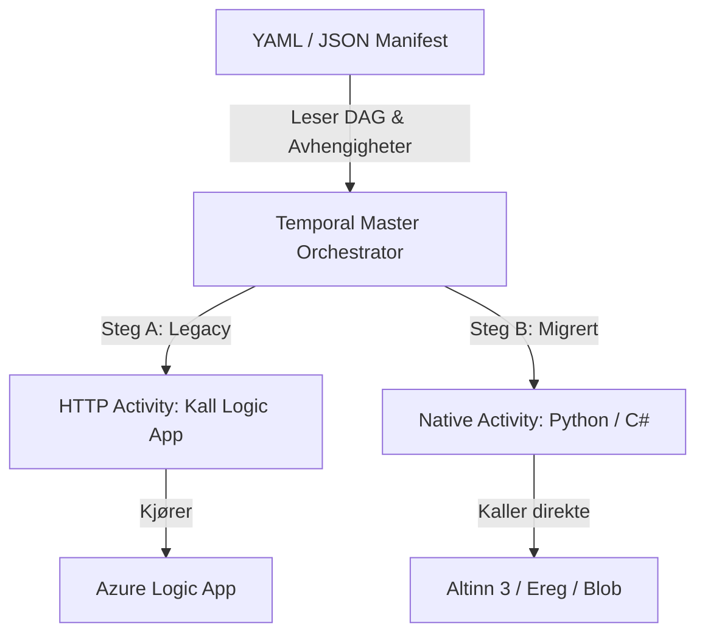
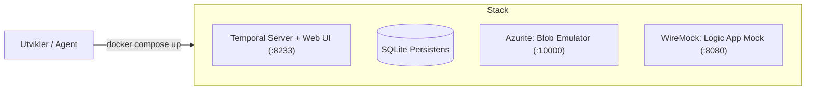
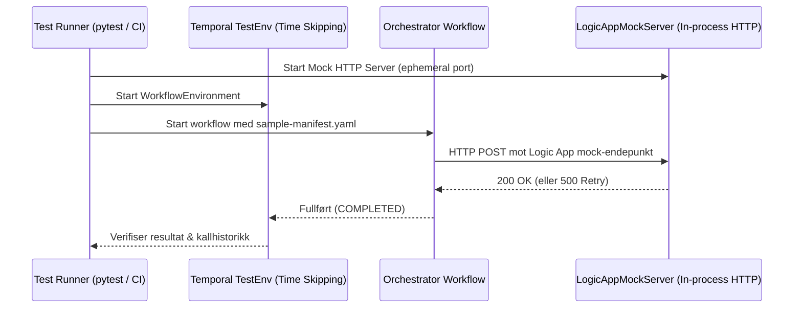

# Temporal Wonder

En test- og evalueringsplattform for å utforske **Temporal** som orkestreringsmotor for integrasjonsplattformen hos Finanstilsynet.

Repositoryet demonstrerer hvordan komplekse integrasjonsflyter kan orkestreres pålitelig, med spesiell vekt på **Strangler Fig-mønsteret** for gradvis migrering bort fra legacy Azure Logic Apps til moderne native aktiviteter.

---

## Kjernekonsepter



1. **Manifest-drevet orkestrering**: Integrasjoner defineres deklarativt som rettede asykliske grafer (DAG) i JSON/YAML.
2. **Strangler Fig-migrering**: Eksisterende Azure Logic Apps kalles via standardiserte HTTP-aktiviteter frem til de erstattes steg for steg med native kode.
3. **Temporal determinisme**: Orkestreringslogikken er 100 % deterministisk og gjenskapbar fra hendelseslogg, mens all I/O og eksterne kall isoleres i aktiviteter.

---

## Prosjektstruktur

```text
temporal-wonder/
├── .devcontainer/                # Devcontainer-oppsett for Python 3.14, uv & Docker
├── docker-compose.yml            # Lokal stack: Temporal dev-server (UI: 8233) & Azurite
├── .env.example                  # Eksempel-miljøvariabler for lokal kjøring
├── schemas/
│   └── manifest.schema.json      # Formelt JSON Schema for integrasjons-DAG
├── examples/
│   ├── sample-manifest.yaml      # Eksempelmanifest med Strangler Fig (legacy & native)
│   └── sample-manifest.json      # JSON-variant for skjemavalidering
├── src/
│   └── temporal_wonder/
│       ├── config.py             # Pydantic Settings for miljø- og tjenestekonfigurasjon
│       ├── worker.py             # Temporal worker-prosess som poller oppgavekøen
│       ├── starter.py            # CLI-verktøy for å starte integrasjons-DAG workflows
│       ├── models/               # Pydantic v2-modeller, DAG-validering og migrering
│       ├── workflows/            # Deterministiske Temporal orchestrator-workflows
│       └── activities/           # I/O-aktiviteter (legacy Logic Apps og native Altinn 3)
│           ├── legacy/           # HTTP-aktiviteter for delegering til Logic Apps
│           └── native/           # Direkte integrasjoner (Altinn 3, Azure Blob, transformasjon)
└── tests/                        # Pytest enhets-, skjema- og workflowtester
    └── unit/                     # Konfigurasjon, docker-compose, skjema, DAG og workflowtester
```

---

## Lokalt utviklermiljø

Plattformen støtter et fullverdig lokalt utviklermiljø uten avhengigheter til Azure-skyressurser.



### 1. Start lokal infrastruktur
Start Temporal dev-server og Azurite med Docker Compose:
```bash
docker compose up -d
```
Tjenestene blir tilgjengelige på:
- **Temporal Web UI**: [http://localhost:8233](http://localhost:8233)
- **Temporal gRPC API**: `localhost:7233`
- **Azurite Blob Service**: `http://localhost:10000`
- **WireMock Logic App Mock**: `http://localhost:8080`

### 2. Konfigurasjon
Kopier eksempelkonfigurasjonen til `.env` ved behov:
```bash
cp .env.example .env
```

### 3. Kjør worker lokalt
I en terminal, start Temporal workeren:
```bash
uv run python -m temporal_wonder.worker
```
Workeren kobler seg til `localhost:7233`, registrerer `IntegrationOrchestratorWorkflow` samt aktiviteter, og begynner å polle oppgavekøen.

### 4. Start en manuell testflyt
I en annen terminal, start en workflow basert på et eksempelmanifest:
```bash
uv run python -m temporal_wonder.starter
```
Du kan også spesifisere en valgfri manifestfil eller egendefinert workflow ID:
```bash
uv run python -m temporal_wonder.starter --manifest examples/sample-manifest.yaml --workflow-id test-krt-run-1
```
Åpne [http://localhost:8233](http://localhost:8233) i nettleseren for å inspisere kjøringen, hendelseshistorikk og tidslinje for hvert steg i DAG-en.

### 5. Stopp lokal infrastruktur
```bash
docker compose down
```

---

## Test-harness og Mock-infrastruktur

Testsuiten kan kjøres helautomatisert og deterministisk uten behov for kjørende Docker-containere eller eksterne nettverkskall:



- **In-process mock-server (`LogicAppMockServer`)**: Starter en lettvekts HTTP-server på `127.0.0.1` med dynamisk portallokering. Støtter rutedefinisjoner, feilsimulering (`500 Internal Server Error`), og sekvensielle responser for å teste Temporal `RetryPolicy`.
- **Temporal `WorkflowEnvironment`**: Utfører tidsspoling for å verifisere retry-intervaller og timeouts momentant i tester.
- **Kjør hele testpakken med én kommando**:
  ```bash
  uv run pytest -v
  ```

---

## Agent- og utviklerretningslinjer

For fullstendige instruksjoner og retningslinjer:
- 🤖 **AI-agenter & Copilot**: Se [AGENTS.md](file:///./AGENTS.md) og [.github/copilot-instructions.md](file:///./.github/copilot-instructions.md)
- 🛠️ **Utviklerveiledning**: Se [DEV_README.md](file:///./DEV_README.md)
- 📦 **Generelle fellesregler**: [`.agents/common-agent-instructions/`](file:///./.agents/common-agent-instructions/README.md)
- 🐍 **Python-regler**: [`.agents/python-agent-instructions/`](file:///./.agents/python-agent-instructions/README.md)
